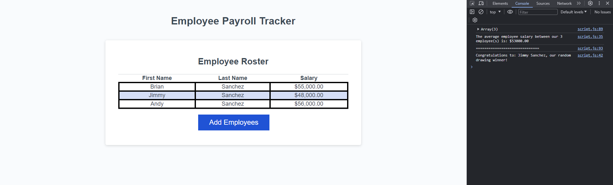

# Employee Payroll Tracker Challenge
## Description

Created a payroll manager application that allows the input of random employees by their first name, last name, and salaries. Application is then able to display array of current inputed employees in the application, the average salary of all employee's salaries inputed, and randomly selecting a drawing winner from the inputed employee names within the application

## Link to Deployed Page
https://bds6575.github.io/Brian-Employee-Payroll-Tracker/